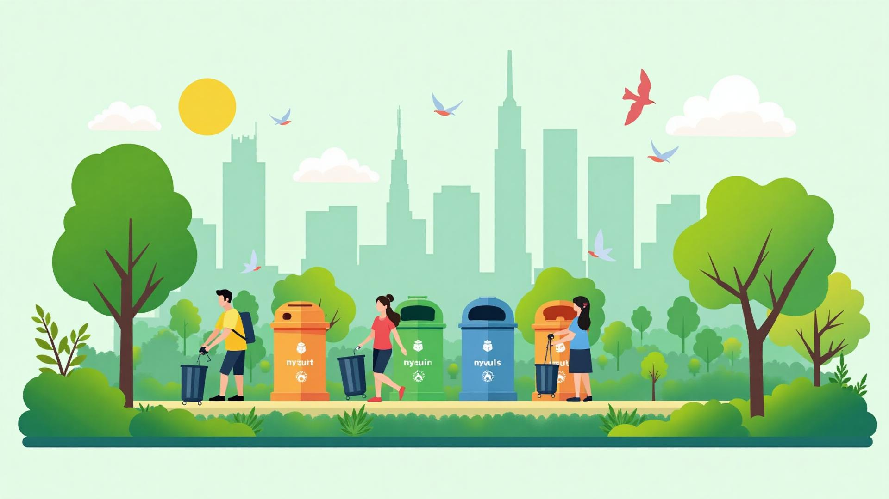

# 🌍 Green Map Hub

> **Empowering communities to track, report, and resolve waste issues for a cleaner, greener future.**



## 📖 Overview

**Green Map Hub** is a modern, interactive web application designed to revolutionize community waste management. By combining GIS-style mapping with social reporting features, it empowers citizens to identify waste hotspots, find recycling centers, and organize community clean-up events.

Built with a focus on **User Experience (UX)** and **Visual Excellence**, the platform features a stunning, eco-themed interface with glassmorphism effects, smooth animations, and intuitive micro-interactions.

## ✨ Key Features

### 🗺️ Interactive Waste Map
- **Real-time Tracking**: Visualize waste hotspots, bins, and recycling centers on a dynamic map.
- **Smart Filters**: Easily toggle between different layers (Hotspots, Bins, Events, etc.).
- **Hover Insights**: Get instant details about any marker with a simple hover.

### 📸 Easy Reporting System
- **Quick Submission**: Report issues like overflowing bins or illegal dumping in seconds.
- **Auto-Location**: Automatically detects your current location for accurate reporting.
- **Visual Evidence**: Upload photos to provide clear context for authorities.

### 🤝 Community Engagement
- **Events & Drives**: Join or organize local clean-up drives and workshops.
- **Gamification**: Earn badges and climb the leaderboard by contributing to a cleaner environment.
- **Impact Tracking**: See the tangible difference you're making with personal and community stats.

### 🎓 Awareness & Education
- **Recycling Guide**: Learn *what* goes *where* with our comprehensive guide.
- **Eco-Tips**: Daily actionable tips to reduce your carbon footprint.

## 🛠️ Tech Stack

- **Frontend**: [React](https://reactjs.org/) (v18) with [TypeScript](https://www.typescriptlang.org/)
- **Build Tool**: [Vite](https://vitejs.dev/)
- **Styling**: [Tailwind CSS](https://tailwindcss.com/) with [Shadcn UI](https://ui.shadcn.com/)
- **State Management**: [React Query](https://tanstack.com/query/latest)
- **Routing**: [React Router](https://reactrouter.com/)
- **Icons**: [Lucide React](https://lucide.dev/)
- **Animations**: Custom CSS animations & transitions

## 🚀 Getting Started

Follow these steps to set up the project locally:

### Prerequisites
- Node.js (v16 or higher)
- npm or yarn

### Installation

1.  **Clone the repository**
    ```bash
    git clone https://github.com/YashvithaaRaniKumar/GreenMap002.git
    cd GreenMap002
    ```

2.  **Install dependencies**
    ```bash
    npm install
    ```

3.  **Start the development server**
    ```bash
    npm run dev
    ```

4.  **Open the app**
    Visit `http://localhost:8080/green-map-hub-main/` in your browser.

## 📂 Project Structure

```
src/
├── components/        # Reusable UI components
│   ├── home/          # Landing page sections
│   ├── map/           # Map interface components
│   ├── layout/        # Navbar, Footer, etc.
│   └── ui/            # Shadcn UI primitives
├── pages/             # Main application pages
├── hooks/             # Custom React hooks
├── lib/               # Utilities and helper functions
└── index.css          # Global styles and Tailwind directives
```

## 🎨 Design System

The project uses a custom **Eco-Theme** designed to evoke nature and cleanliness:
- **Primary Colors**: Deep Emerald & Fresh Leaf Green
- **Accents**: Ocean Blue & Earthy Brown
- **Effects**: Glassmorphism panels, soft shadows, and organic gradients.

## 🤝 Contributing

We welcome contributions! Please feel free to submit a Pull Request.

---

*Built with 💚 for a better planet.*
